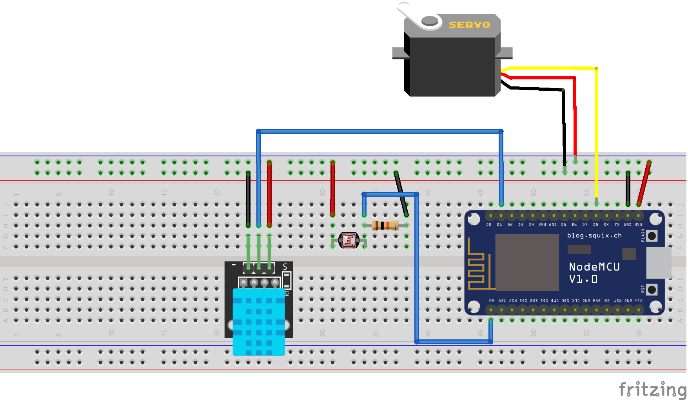
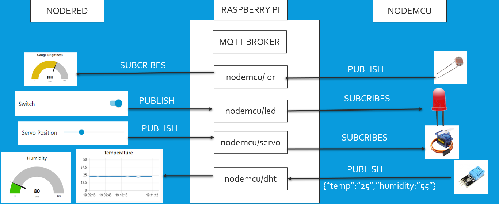
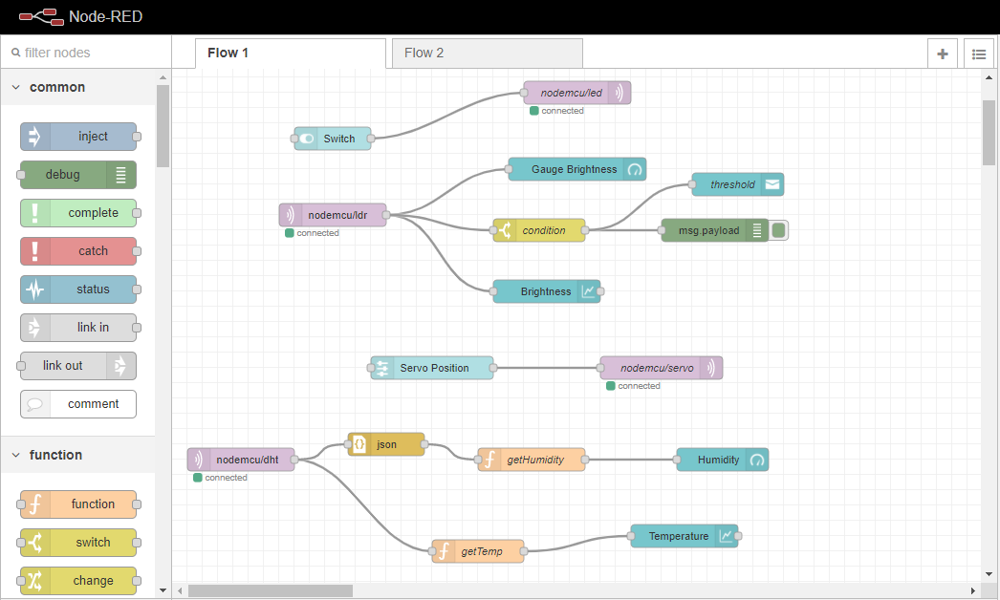
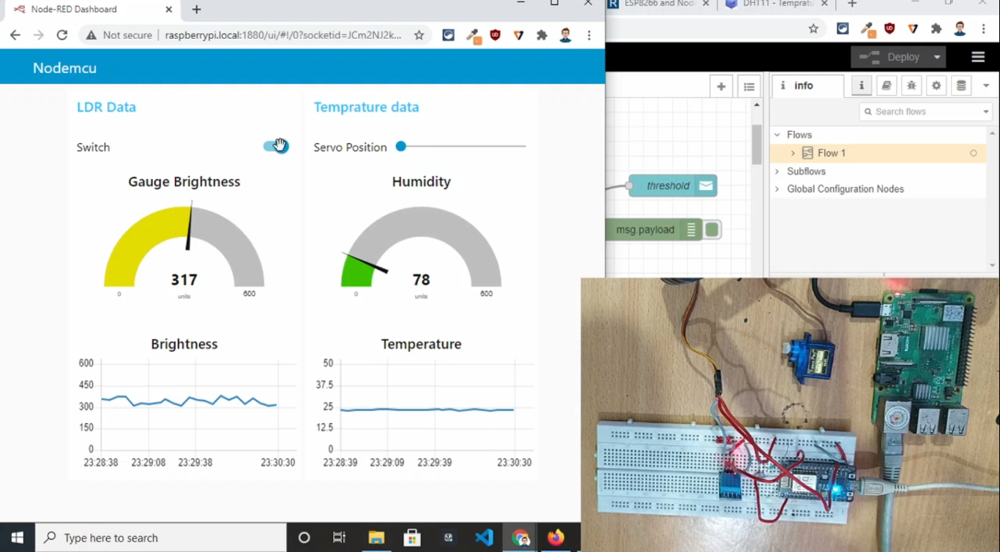

# Nodered Management Dashboard with Raspberry Pi and Nodemcu using MQTT.

## ARDUINO CODE and nodered flow

1. nodered_mqtt/nodered_mqtt.ino -> Arduino code for connecting with MQTT broker and send data from DHT 11 temperature sensor.

2. flow.json -> Nodered flow.

## CIRCUIT DIAGRAM

## ARCHITECTURE

## NODERED FLOW

## NODERED UI DASHBOARD

## LINK FOR WRITTEN BLOG

